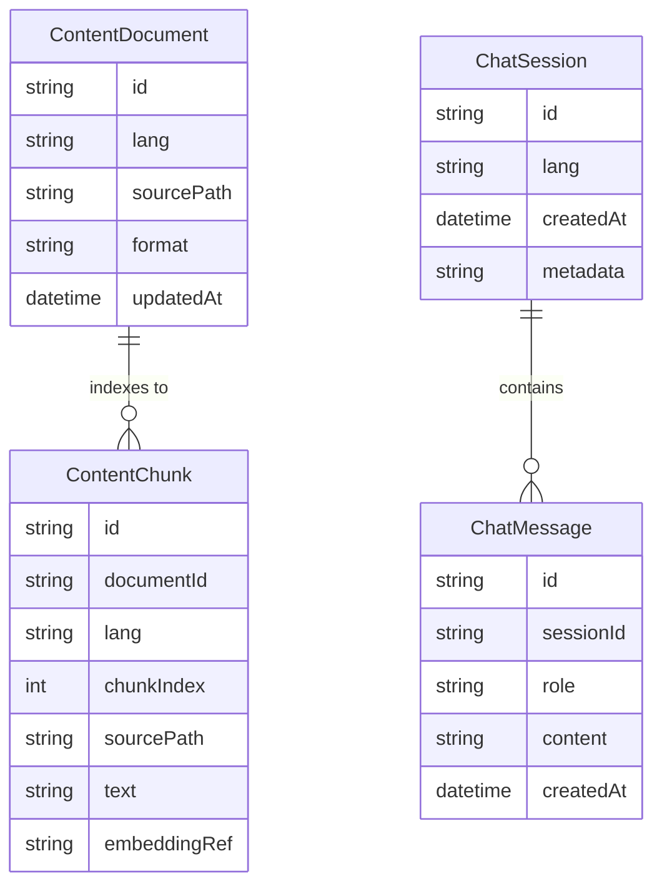

# CV — Data Model (Conceptual)

This document describes the **conceptual data model** for CV.
The project is intentionally content-driven: CV information is stored as **Markdown/JSON** under `content/`
and is served by the backend as structured JSON for the frontend.

The chat feature is **CV-scoped** and must not answer outside the CV content.

---

## 1) Core principles

1. **Content-first**: the CV is not hardcoded in UI components.
2. **Bilingual**: every content unit has `es` and `en` variants (when applicable).
3. **Stable IDs**: each section/item should have stable identifiers so links and citations remain valid.
4. **RAG-ready**: content can be indexed into chunks for retrieval (optional at first, but designed in).

---

## 2) Logical entities

### 2.1 ContentDocument
A source document living in the repo (Markdown/JSON) that represents a CV section or part of it.

**Fields**
- `id` (string): stable ID (e.g. `experience`, `projects`, `profile`)
- `lang` (`es|en`)
- `sourcePath` (string): path inside `content/` (e.g. `content/es/experience.md`)
- `format` (`markdown|json`)
- `updatedAt` (datetime)

### 2.2 CvDocument (API output)
Aggregated view that the backend returns to the frontend.

**Fields (high-level)**
- `lang`
- `updatedAt`
- `profile`
- `experience[]`
- `projects[]`
- `skills[]`
- `education[]` (optional)
- `certifications[]` (optional)
- `languages[]` (optional)

> This is a projection, not necessarily persisted as a single file.

### 2.3 ChatSession (optional persistence)
If you decide to persist sessions (not required for v1), a session groups messages.

**Fields**
- `id` (string)
- `createdAt` (datetime)
- `lang` (`es|en`)
- `metadata` (object)

### 2.4 ChatMessage (optional persistence)
A message belonging to a chat session.

**Fields**
- `id` (string)
- `sessionId` (string)
- `role` (`user|assistant|system`)
- `content` (string)
- `createdAt` (datetime)

### 2.5 ContentChunk (for retrieval / RAG)
A chunk is a slice of a ContentDocument used for semantic search and citations.

**Fields**
- `id` (string)
- `documentId` (string)
- `lang` (`es|en`)
- `chunkIndex` (int)
- `text` (string)
- `sourcePath` (string)
- `range` (optional): start/end positions
- `embeddingRef` (string|nullable): pointer to vector store entry (implementation-specific)

### 2.6 RetrievalCitation (chat output)
Represents what the assistant cites in the response.

**Fields**
- `sourceId` (string): usually the `sourcePath` or `documentId`
- `title` (string): section title (e.g. `Experience`)
- `snippet` (string|nullable)

---

## 3) Relationship overview

- A `CvDocument` is **composed of** multiple `ContentDocument` instances.
- A `ContentDocument` can be indexed into many `ContentChunk` rows.
- A `ChatSession` contains many `ChatMessage` rows.
- A chat response may include many `RetrievalCitation` entries pointing to `ContentDocument/Chunk`.

---

## 4) ER diagram (conceptual)

---

## 5) Notes on storage (implementation choices)

### v1 (simple)
- `content/` files are the source of truth.
- Index/chunks can be built on startup (in-memory) or on demand.
- No DB required.

### v2 (scaling)
- Persist `ContentChunk` (and optionally `ChatSession/ChatMessage`) in a DB.
- Use a vector store for embeddings (or a DB with vector support).
- Keep the public API unchanged: only internal storage evolves.

---

## 6) Where this maps in the repo

- Source content: `content/es/**`, `content/en/**`
- API contract: `docs/api/api-spec.yml`
- This doc: `docs/architecture/data-model.md`
- AI/SDD standards + commands: `ai-specs/**`
